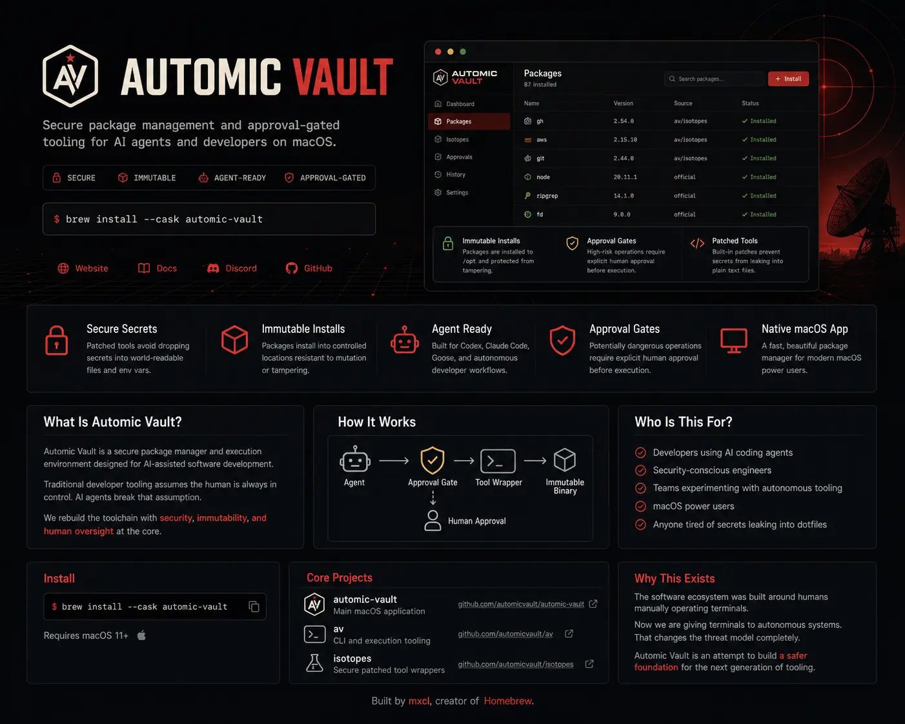

<h1 align="center">AUTOMIC VAULT</h1>

<p align="center">
  <strong>Secure package management and approval-gated tooling for AI agents and developers on macOS.</strong>
</p>

<p align="center">
  Built for the era of Codex, Claude Code, Goose, and autonomous developer tooling.
</p>

<p align="center">
  <a href="https://automicvault.com">Website</a>
  ·
  <a href="https://automicvault.com/docs/">Documentation</a>
  ·
  <a href="https://github.com/automic-vault/automic-vault">Main Repo</a>
</p>

---

## What Is Automic Vault?

Automic Vault is a secure package manager and execution environment designed for AI-assisted software development.

Traditional developer tooling assumes:

- the human is always typing
- secrets in plaintext are acceptable
- binaries in your PATH are trustworthy forever
- tools can freely mutate themselves

AI agents break those assumptions.

Automic Vault rebuilds the developer toolchain around that reality.

---

## Features

| Feature | Description |
|---|---|
| 🔒 Secure Secret Handling | Patched tools avoid dropping secrets into world-readable files and environment variables |
| 🧊 Immutable Installs | Packages install into controlled locations resistant to mutation |
| 🤖 Agent Ready | Designed for Codex, Claude Code, Goose, and autonomous tooling |
| 🛑 Approval Gates | High-risk operations can require explicit human approval |
| 🖥️ Native macOS App | Fast package management GUI for modern developer workflows |

---

## AI-Agent Safe Tooling

Prevent autonomous agents from silently:

- modifying critical tooling
- replacing binaries in your PATH
- exfiltrating credentials
- executing destructive commands
- mutating long-lived developer environments

Automic Vault introduces approval-gated execution and immutable tooling assumptions for agentic workflows.

---

## Secure Secret Handling

Patched versions of tools such as:

- `gh`
- `aws`
- `npm`
- `git`

avoid common plaintext secret storage patterns.

The goal is simple:

> agents should not inherit unrestricted access to your machine just because a token exists somewhere in `$HOME`.

---

## Immutable Package Installs

Packages are installed into controlled system locations such as:

```text
/opt
/usr/local/bin
````

This reduces the ability for malware, compromised scripts, or autonomous agents to silently replace tooling after installation.

---

## Approval Gates

Potentially dangerous operations can require explicit human approval before execution.

Examples include:

* destructive filesystem operations
* remote infrastructure changes
* credential access
* irreversible commands
* large blast-radius actions

```text
Agent ──▶ Approval Gate ──▶ Tool Wrapper ──▶ Immutable Binary
                     │
                     └──▶ Human Approval
```

---

## Native macOS Package Manager

Automic Vault also ships with a modern native package manager app for macOS.

Install and manage:

* CLI tools
* AI coding agents
* developer runtimes
* Unix utilities
* secure tool wrappers
* curated tooling packs

without turning your machine into archaeological sediment.

---

## Who Is This For?

* Developers using AI coding agents
* Security-conscious engineers
* Teams experimenting with autonomous tooling
* macOS power users
* Anyone tired of secrets leaking into dotfiles

---

## Install

Download the latest release from the
[GitHub releases page](https://github.com/automic-vault/automic-vault/releases/latest).

Or we provide a cURL one-liner:

```sh
curl -sSfL https://automicvault.com/install.sh | sh
```

This verifies our code-signature and team ID before installing the app to your
Applications folder. It’s a slightly more reassuring way of just downloading
the DMG yourself. It’s just a slightly more thorough version of the following
which you can copy & paste into a terminal if you like:

```bash
tmp="$(mktemp -d)" \
  && /usr/bin/curl -sSfL 'https://automicvault.com/av.dmg' -o "$tmp/av.dmg" \
  && /usr/sbin/spctl -a -vv --type open "$tmp/av.dmg" \
  && /usr/bin/hdiutil attach "$tmp/av.dmg" -mountpoint "$tmp/mnt" -nobrowse -quiet \
  && app="$(find "$tmp/mnt" -maxdepth 1 -name '*.app' -print -quit)" \
  && /usr/bin/codesign -dv --verbose=4 "$app" 2>&1 | /usr/bin/grep -q '^TeamIdentifier=ZU76A67LGU$' \
  && /usr/bin/ditto "$app" "/Applications/$(basename "$app")"
  && /usr/bin/hdiutil detach "$tmp/mnt" -quiet \
  && /bin/rm -rf "$tmp"
```

---

## Core Projects

| Repository                                                        | Purpose                      |
| ----------------------------------------------------------------- | ---------------------------- |
| [`automic-vault`](https://github.com/automic-vault/automic-vault) | Main macOS application       |
| [`av`](https://github.com/automic-vault/automic-vault)            | CLI and execution tooling    |
| [`isotopes`](https://github.com/automic-vault/isotopes)           | Secure patched tool wrappers |

---

## Why This Exists

The software ecosystem was built around humans manually operating terminals.

Now we are giving terminals to autonomous systems.

That changes the threat model completely.

Automic Vault is an attempt to build a safer foundation for the next generation of developer tooling.

---

<p align="center">
  <sub>
    Built by <a href="https://mxcl.dev">mxcl</a>, creator of Homebrew.
  </sub>
</p>
